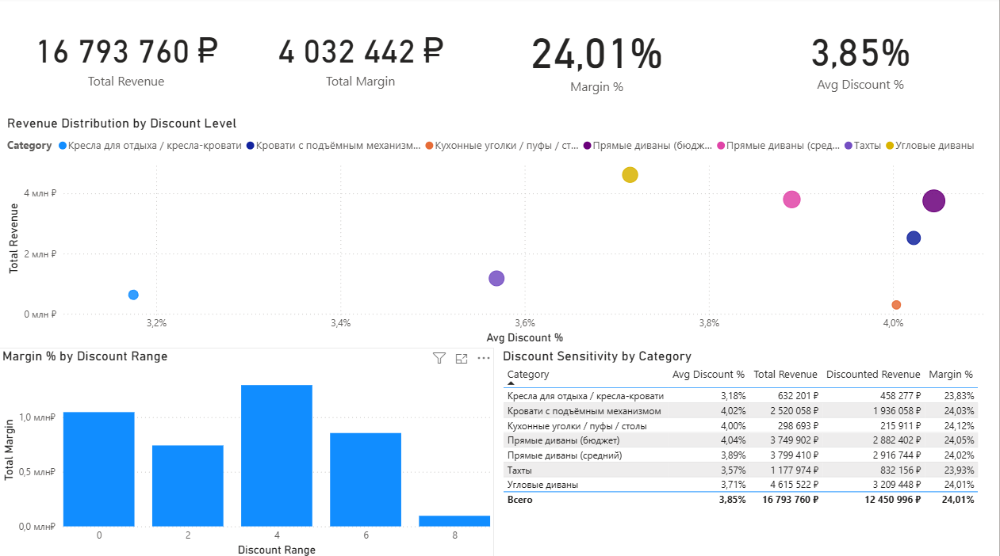

# Power BI Dashboard — Furniture Sales Analytics

Интерактивный аналитический дашборд по продажам мебельной компании, реализованный в **Power BI**.  
Проект направлен на анализ выручки, клиентской базы и влияния скидок на финансовые показатели бизнеса.

---

## Основные страницы отчёта

### 1. Общий обзор продаж

- Общая выручка и маржа
- Количество заказов и средний чек
- Динамика выручки по месяцам
- Анализ продаж по категориям и городам

---

### 2. RFM-анализ клиентской базы

- Сегментация клиентов по RFM (Recency, Frequency, Monetary)
- Распределение выручки по клиентским сегментам
- Анализ повторных покупок
- Определение ключевых и проблемных сегментов клиентов

---

### 3. Анализ влияния скидок

- Зависимость выручки и маржи от уровня скидки
- Анализ чувствительности товарных категорий к скидкам
- Выявление безопасного уровня скидок для бизнеса

---

## Используемые данные

- Данные о продажах мебели
- Период: 2023–2024
- Основные поля: заказы, клиенты, категории товаров, цены, скидки, маржа, города, даты

---

## Инструменты и навыки

- Power BI Desktop  
- Моделирование данных (звёздная схема)  
- DAX (CALCULATE, RANKX, FILTER, DIVIDE)  
- Бизнес-аналитика и визуализация данных  

---

## Цель проекта

Демонстрация навыков построения аналитических отчётов в Power BI:
- от подготовки модели данных  
- до визуализации и бизнес-интерпретации результатов  

Проект выполнен в рамках формирования портфолио BI-аналитика.
